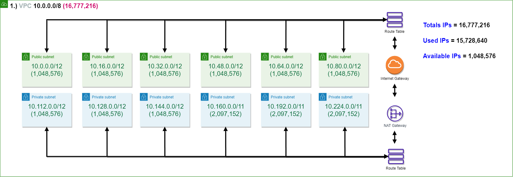
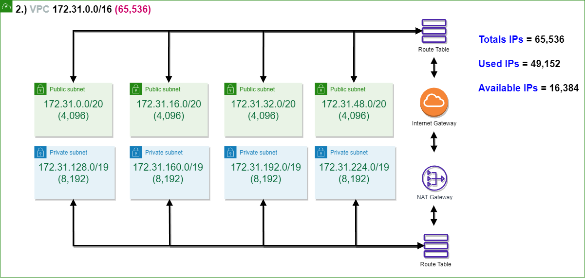
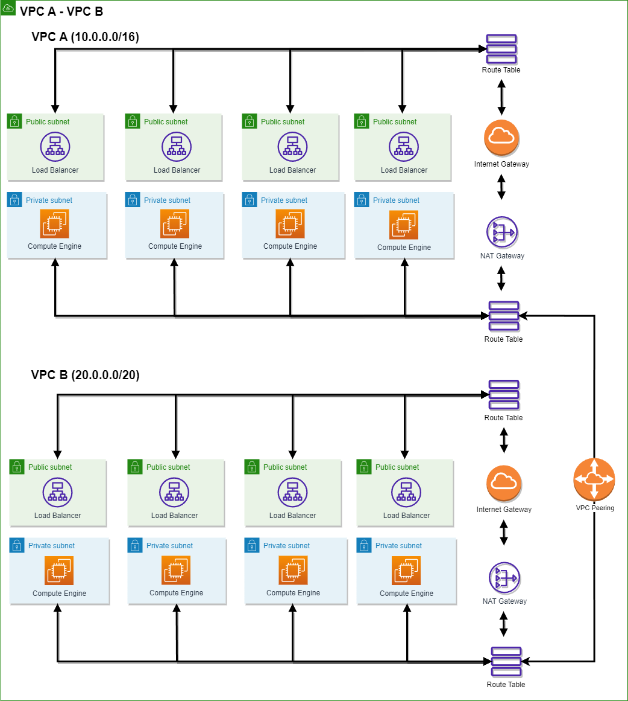
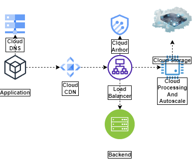
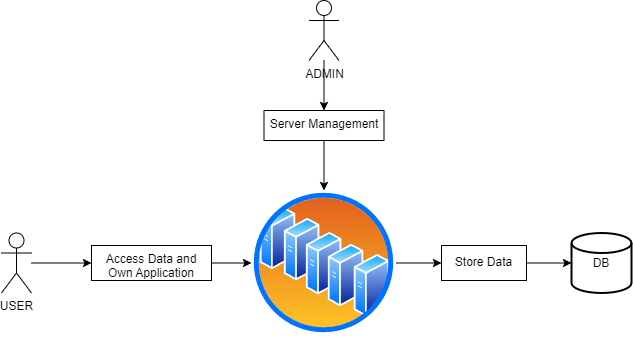

# Assignment #6
> * 🐇(1) กำหนดให้ VPC มี CIDR range 10.0.0.0/8 จงออกแบบ subnet(vswitch) โดยให้เหลือจำนวน Available IPs น้อยที่สุด (ออกแบบให้สามารถมีการขยายระบบได้)

---
> *  😺(2) กำหนดให้ VPC มี CIDR range  172.31. 0.0/16 จงออกแบบ subnet(vswitch) โดยให้เหลือจำนวน Available IPs น้อยที่สุด (ออกแบบให้สามารถมีการขยายระบบได้)

---
> *  🐼(3) จากคำตอบข้อ 1 และ 2 ให้ตอบคำถามย่อยต่อไปนี้
>       * 3.1)ต้องใช้ Service อะไรที่ทำให้ VPC จากข้อที่ 1 และ 2 สามารถรับส่งข้อมูลถึงกันได้
>         * ## Service ที่ต้องใช้คือ VPC Peering เพื่อนำ Peering-id นำไปกำหนดใน Route Table
>       * 3.2)จงวาดตาราง Route Table พร้อมระบุการ ค่าให้เรียบร้อย
> 
>            | 🙈 Route Table 	| 🙉 Destination 	| 🙊 target     	|  
>            |:-----------:	|-------------	|------------	|
>            | **VPC A**       	| VPC A CIDR  	| Local      	|
>            |             	| VPC B CIDR  	| Peering-ID 	|
>            | **VPC B**       	| VPC B CIDR  	| Local      	|
>            |             	| VPC A CIDR  	| Peering-ID 	|
>
>            | 🙈 Route Table 	| 🙉 Destination 	| 🙊 target     	|  
>            |:-----------:	|-------------	|------------	|
>            | **VPC A**       	| 10.0.0.0/8  	| Local      	|
>            |             	| 172.31.0.0/16  	| Peering-ID 	|
>            | **VPC B**       	| 172.31.0.0/16 	| Local      	|
>            |             	| 10.0.0.0/8 	| Peering-ID 	|
---

> *  🦒(4) (optional)ให้ออกแบบระบบซื้อขายของออนไลน์โดยมีองค์ประกอบดังนี้
>       * 4.1) สินค้า (product), ตะกร้าสินค้า(cart), จ่ายเงิน(payment), การขนส่งสิ่นค้า(Shipping), ผู้ใช้ (user)
>       * 4.2) Database Servic
>       * 4.3) สามารถรองรับผู้ใช้งานได้จำนวนมหาศาล (แบบง่าย)
---

> *  🦄(5) กำหนดให้ VPC A มี CIDR (10.0.0.0/16) และ VPC B  มี CIDR (10.0.0.0/20)จงตอบคำถามต่อไปนี้
>       * 5.1)VPC A และ VPC B สามารถ peering กันได้หรือไม่ หากไม่ได้จงบอกเหตุผล
>           * ## ไม่ได้ ทั้งสอง IP เกิด Overlap กัน (มีช่วงการใช้งานของ IP ที่ทับซ้อนกัน) ต้องแก้ด้วยการเปลี่ยนช่วงของ IP ที่ VPC ฝั่งใดฝั่งหนึ่ง
>       * 5.2)กรณีถ้า Peering ได้ จะต้องทำอย่างไร ให้ service ที่อยู่ภายใน VPC ทั้งสองสามารถติดต่อสื่อสารกันได้
>           * ## <กรณีทำไม่ได้> แก้ไขด้วยการย้าย IP ของ VPC B ขาก 10.0.0.0/20 เป็น 20.0.0.0/20
>           * ## สามารถออกแบบตาราง Route Table ได้ดังนี้
>
>            | 🙈 Route Table 	| 🙉 Destination 	| 🙊 target     	|  
>            |:-----------:	|-------------	|------------	|
>            | **VPC A**       	| 10.0.0.0/16  	| Local      	|
>            |             	| 20.0.0.0/20  	| Peering-ID 	|
>            | **VPC B**       	| 20.0.0.0/20 	| Local      	|
>            |             	| 10.0.0.0/16 	| Peering-ID 	|
>       * 5.3)ให้วาดรูป architecture ประกอบ
>       * 5.4)(Optional) ใส่ component อื่นๆ ให้ครบ เช่น LB, Compute Engine, NatGW
> 
---

> *  🦉(6) Hypervisor มีกี่ประเภทแต่ละประเภทคืออะไรบ้าง แล้วประเภทไหนที่ Computerของเราใช้งานในการเปิด emulator 
>       * ## มี 2 Type
>       * ## Type I : เป็นการแบ่งระบบ OS โดยไม่ผ่านตัวกลาง (Host OS) ทำให้แต่ละ OS ที่ถูกแบ่งให้กับ Guest นั้นสามารถเข้าถึงระบบได้อย่างเต็มที่ ตามขนาดและขอบเขตที่ได้กำหนดไว้
>       * ## Type II : เป็นประเภทที่เราได้ใช้กันอยู่ประจำ เช่นการจำลอง OS บน OS ที่เราใช้อยู่ เช่น จำลอง Android บน Windows เป็นต้น จะเห็นได้ว่าเราสามารถจำลองระบบได้แต่ยังคงต้องผ่าน OS ที่เราใช้งานอยู่ ทำให้ประสิทธิภาพที่ได้ออกมานั้น ไม่เต็มที่
>       * ## ประเภทไหนที่ Computerของเราใช้งานในการเปิด emulator : Hypervisor Type II  
---
> *  🐶(7) (optional) ให้ออกแบบ architecture ที่นำ application ของเรามาเชื่อมต่อกับ Cloud (ไม่มีผิดไม่มีถูกอยากให้ลองออกแบบกันมาว่าถ้า application ของเราขึ้นไปอยู่บน cloud จะมีหน้าตาแบบไหน)
>       * ## มั่วๆมาจาก Google Cloud Platform 
> 

---

> *  🐰(8) ให้ตอบคำถามต่อไปนี้เกี่ยวกับ Debian 
>       * 8.1)Debian คืออะไร 
>           * ## Debian เป็นระบบปฏิบัติการที่เป็นการพัฒนาขึ้นจากจากคนที่อยู่ใน Community อย่างเสรี ไม่มีบุคคลอยู๋เบื้องหลังในการพัฒนา
>       * 8.2)version stable ล่าสุดมีชื่อเล่นว่าอะไร
>           * ## Debian 11.6 "Bullseye"
>       * 8.3)Package Manager ต้องใช้คำสั่งอะไร
>           * ##  apt -> apt update , apt install , apt upgrade ,etc.
>           * ## cat /etc/os-release , cat /etc/debian_version
>       * 8.4)หากต้องการติดตั้ง git ควรใช้คำสั่งอะไร
>           * ## apt install git

---
> *  🐮(9) ให้ตอบคำถามต่อไปนี้เกี่ยวกับ Alpine  
>       * 9.1)Alpine คืออะไร 
>           * ## Alphine เป็น Linux Distribution ที่มีขนาดเล็ก ไม่เกิน 8 mb และใช้พื้นที่โดยรวมไม่เกิน 180 mb ถูกใช้อยู่ใน Container มีความปลอดภัยสูง
>       * 9.2)version stable ล่าสุดมีคือ version อะไร
>           * ## 3.17
>       * 9.3)Package Manager ต้องใช้คำสั่งอะไร
>           * ## apk -> apk update , apk add , apk upgrade ,etc.
>           * ## cat /etc/os-release , cat /etc/alpine-release
>       * 9.4)หากต้องการติดตั้ง git ควรใช้คำสั่งอะไร
>           * ## apk add git

---
> *  🐔(10) ให้ตอบคำถามต่อไปนี้เกี่ยวกับ Amazonlinux   
>       * 10.1)Amazonlinux คืออะไร 
>           * ## Amazonlinux เป็น Linux Distribution ที่ถูกพัฒนาขึ้นโดย Amazon web service มีความเสถียรสูง และมีประสิทธิภาพสูง เหมาะสำหรับApplication ที่ทำงานบน Amazon EC2
>       * 10.2)version stable ล่าสุดมีชื่อเล่นว่าอะไร
>           * ## Amazon Linux 2 2022.09.1
>       * 10.3)Package Manager ต้องใช้คำสั่งอะไร
>           * ## yum -> yum update , yum install , yum upgrade ,etc.
>           * ## cat /etc/os-release , cat /etc/system-release
>       * 10.4)หากต้องการติดตั้ง git ควรใช้คำสั่งอะไร
>           * ## yum install git

---
> *  🐸(11) หากเราต้องการสร้างบริษัทเป็นผู้ให้บริการ Cloud จงตอบคำถามต่อไปนี้
>       * 11.1)เราควรมีอุปกรณ์ Hardware อะไรบ้าง พร้อมอธิบาย 
>           * ## 1. อุปกรณ์เครือข่าย ช่องทางการเชื่อมต่อ ติดต่อสื่อสารระหว่าง Cloud กับ Client และ บริการต่างๆ รวมไปถึง อุปกรณ์เครือข่ายที่ใช้ในการเชื่อมต่อกับอุปกรณ์อื่นๆ
>           * ## 2. อุปกรณ์เก็บข้อมูล ที่ใช้ในการเก็บข้อมูลของ Cloud และ Client มีขนาดที่ใหญ่เพียงพอ มีความปลอดภัยสูง มีประสิทธิภาพสูง และมีการสำรองข้อมูลอย่างเหมาะสม
>           * ## 3. อุปกรณ์คอมพิวเตอร์ เข้าและเข้าถึงข้อมูล ประมวลผลข้อมูล 
>       * 11.2)เราควรมี Software อะไรบ้าง พร้อมอธิบาย
>           * ## 1. ระบบปฏิบัติการ ที่ใช้ในการทำงานของ Cloud และ Client 
>           * ## 2. ซอฟต์แวร์รักษาความปลอดภัย ป้องกันไวรัส 
>           * ## 3. ซอฟต์แวร์กู้คืนข้อมูล ในกรณีที่ข้อมูลของ Cloud หรือ Client มีปัญหา หรือ ข้อมูลของ Client ถูกลบโดยไม่ตั้งใจ
>           * ## 4. ซอฟต์แวร์จัดสรรการจัดพื้นที่ของ Cloud
>       * 11.3)วาดภาพ Architecture ของ Cloud Service ของเรา
> 
>       * 11.4)ชื่อ Cloud ที่เราให้บริการมีชื่อว่าอะไร
>           * ## Binary Ace Cloud
>       * 11.5)Cloud ของเรามี service อะไร ที่ให้บริการผู้ใช้งานได้บ้าง
>           * ## 1. บริการเก็บข้อมูล ให้บริการเก็บข้อมูลของ Client และ Cloud ในรูปแบบของ Cloud Storage ที่มีประสิทธิภาพสูง มีความปลอดภัยสูง และมีการสำรองข้อมูลอย่างเหมาะสม
>           * ## 2. บริการเชื่อมต่อ ให้บริการเชื่อมต่อระหว่าง Cloud กับ Client 
>           * ## 3. บริการช่วยเหลือลูกค้า มีตัวอย่างการเข้าถึงบริการต่าง ๆ ตามประเภทที่สามารถใช้งานได้ สามารถเลือกและใช้งานได้ง่ายขึ้น
>           * ## 4. บริการความปลอดภัย ให้บริการป้องกันข้อมูลของลูกค้าที่อยู่บน Cloud 

---

©️ Apinun Umbao 6303051623195 EnET-C 🦥
